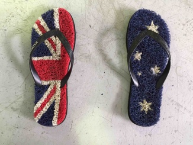

# flip-flop-protocol

*A client/multi-server event-bus protocol suitable for low-speed, half-duplex communications.*

Flip-flop is an OSI-style application layer protocol optimised for half-duplex communication where a single client may command one of a number of servers. The server matching the address of a command will respond with an event. No other server is permitted to respond.

Commands instruct a server to do something, normally resulting in an event. All commands convey an offset to the last event that the client received. Commands are user-definable and have an id.

A server maintains a history of events which may or may not be in relation to the processing of a command received. Events are designated with an offset.

A server always replies to a command with the next "nearest" event. The "nearest" event from a command's last offset is one that ascends in its magnitude. 

A special command with an id of "0" is known as the "Event" command and causes a server to respond with its nearest event. All server implementations must support the "Event" command.

Offsets are held as an unsigned 32 bit integer and may overflow to zero. In the situation of having overflowed, a client must forget all prior events and a server must ensure that any important events are re-sent.

The client assumes the addresses of its servers and cycles through each by sending a command and then waiting for a server response within a timeout period. Servers are aware of the timeout and must never start sending data beyond this period.

A simplified link layer protocol is also provided by this project so that flip-flop can be used where IP networks are not present e.g. with serial communications such as RS-485. This data layer provides a server address, a server port, an opaque variable length payload, and a CRC for error checking.

## Why flip-flop?

Reason #1: data flow between a client and server "flip flops" i.e. can be only ever in one of two states of flow.

Reason #2: We thought it was catchy.

Reason #3: We like Flip Flops (otherwise known as "Thongs"!).

[Image courtesy of Wikimedia and licensed under CC BY-SA 4.0](https://commons.wikimedia.org/wiki/Category:Flip-flops_(footwear)#/media/File:Australia_Day_Thongs.tiff).

## Contribution policy

Contributions via GitHub pull requests are gladly accepted from their original author. Along with any pull requests, please state that the contribution is your original work and that you license the work to the project under the project's open source license. Whether or not you state this explicitly, by submitting any copyrighted material via pull request, email, or other means you agree to license the material under the project's open source license and warrant that you have the legal authority to do so.

## License

This code is open source software licensed under the [Apache-2.0 license](./LICENSE).

© Copyright [Titan Class P/L](https://www.titanclass.com.au/), 2021